# DSA Java QA Harness — 40 Questions + 20 Algorithms (and more)

> A runnable, tested study guide: **40 DSA interview questions** and **20 core algorithms** from
> `DSA_Interview_Questions_40_Java.md` + `dsa-ultimate.md`, implemented in **modern Java** (records,
> `sealed`, `var`, Stream API, generics + wildcards, `Optional`, pattern-matching `switch`) and pinned
> down with **96 JUnit 5 tests**. Every question and every algorithm below has its own mermaid
> diagram (rendered to PNG) showing the core flow + the test anchor.

---

## 🗺️ Start here — architecture & coverage

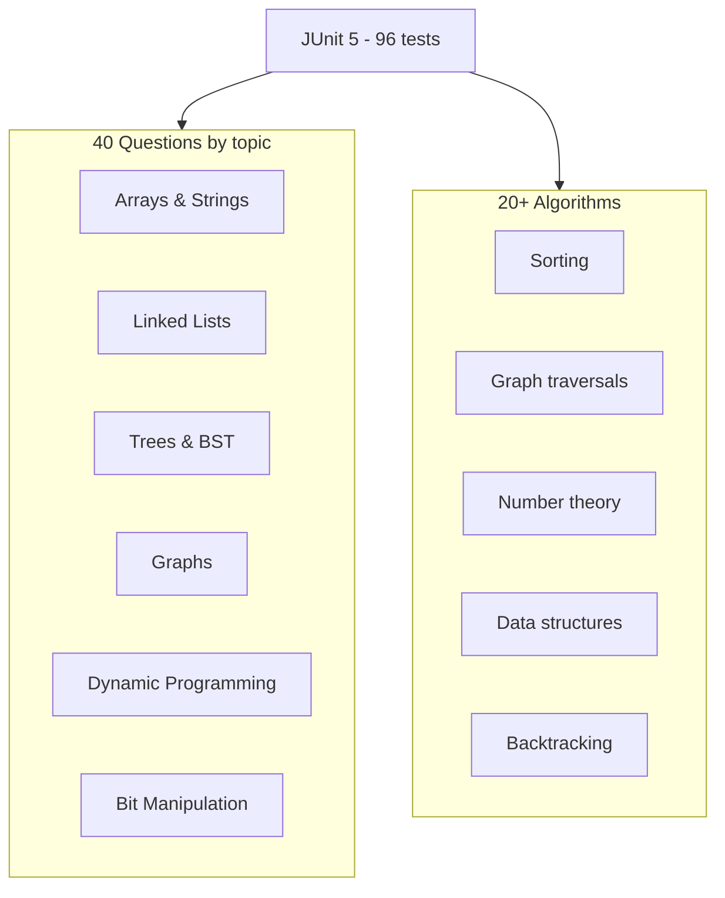

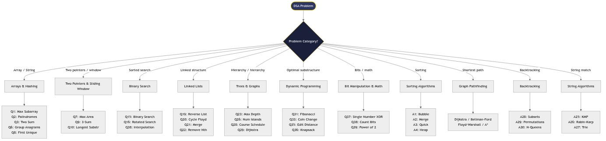

---

## 🚀 Quick start (clone → run → test)

```bash
git clone https://github.com/dbillion/dsa-java-gradleqa.git
cd dsa-java-gradleqa

export JAVA_HOME="$HOME/.sdkman/candidates/java/17.0.12-graal"
export PATH="$JAVA_HOME/bin:$PATH"

./gradlew test          # 96 JUnit tests, all green
```

Run a single algorithm from `main()` if you add one, or just trust the test suite — each `@Test`
is named after its question/algorithm (e.g. `Q3_twoSum`, `A4_heapSort`).

---

## 📚 The 40 Questions (each has a diagram)

### Arrays & Strings
| # | Question | Diagram |
|---|---|---|
| Q1 | Max sum subarray (Kadane) | 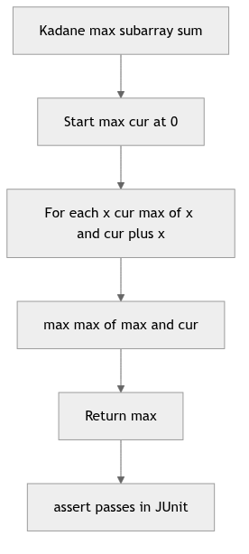 |
| Q2 | All palindromic substrings | 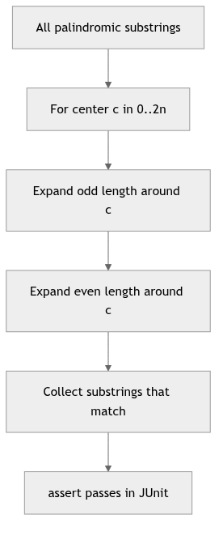 |
| Q3 | Two Sum | 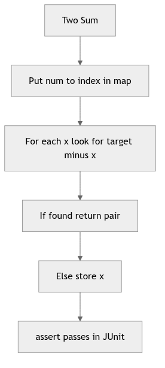 |
| Q4 | Kadane via prefix sums | 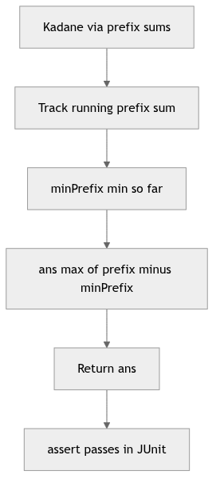 |
| Q5 | Missing number (xor) | 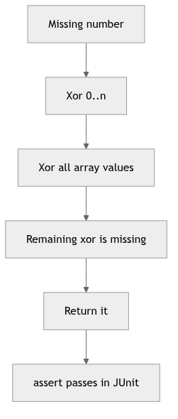 |
| Q6 | Group anagrams / Merge two sorted | 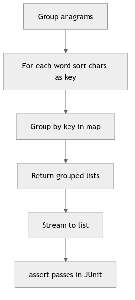 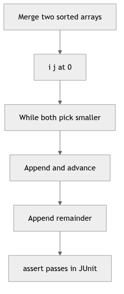 |
| Q7 | Container max area | 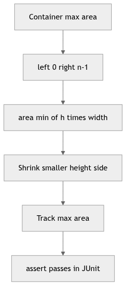 |
| Q8 | First unique char | 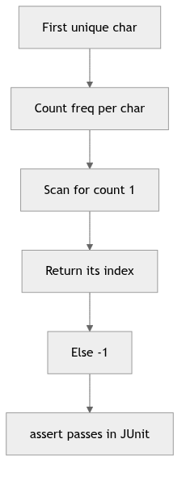 |
| Q9 | 3Sum / Remove duplicates | 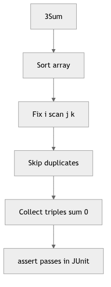 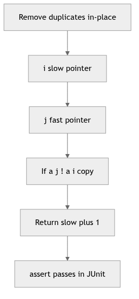 |
| Q10 | Longest substring no repeat | 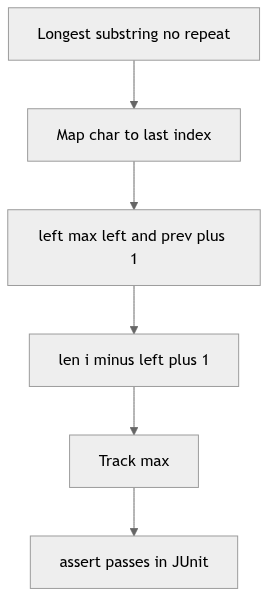 |
| Q11 | Valid palindrome | 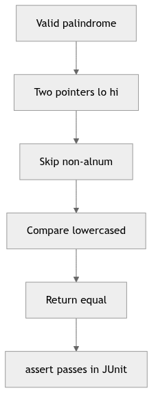 |
| Q12 | Longest common prefix | 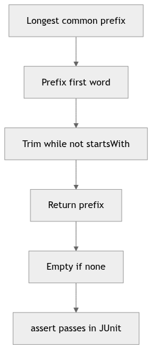 |
| Q13 | Valid parentheses | 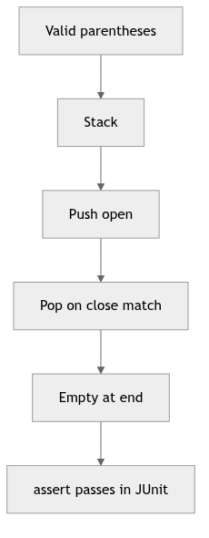 |
| Q14 | Run-length encode | 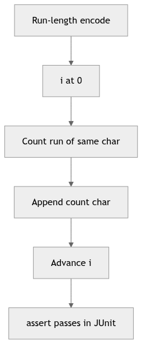 |
| Q15 | Binary search | 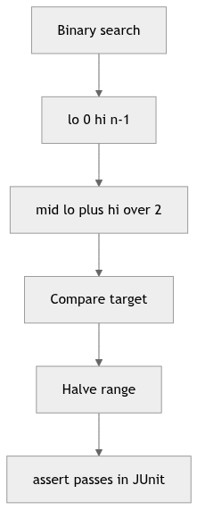 |

### Linked Lists & Stacks/Queues
| # | Question | Diagram |
|---|---|---|
| Q16 | Search rotated / Array stack | 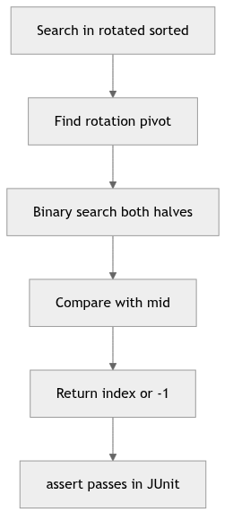 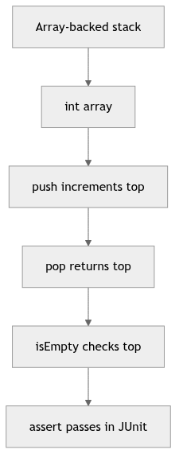 |
| Q17 | First bad version / Min stack | 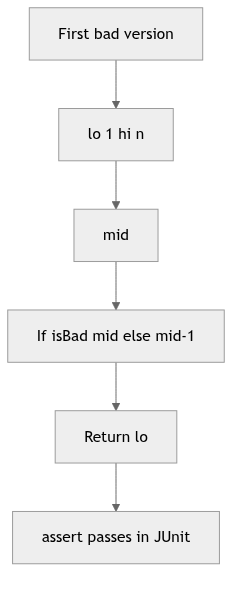 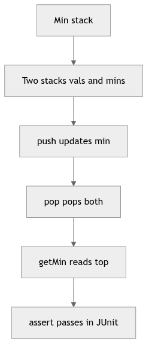 |
| Q18 | Median of two sorted / Circular queue | 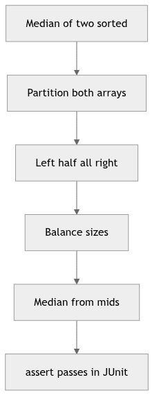 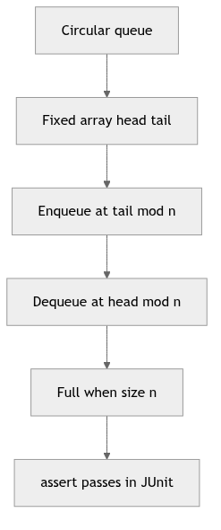 |
| Q19 | Reverse list / Max stack | 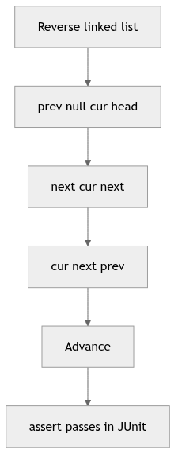 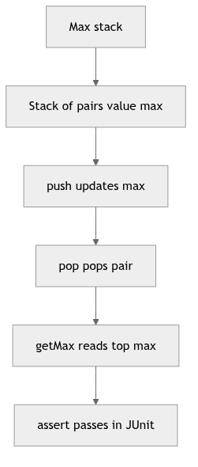 |
| Q20 | Linked list cycle / Queue w/ stacks | 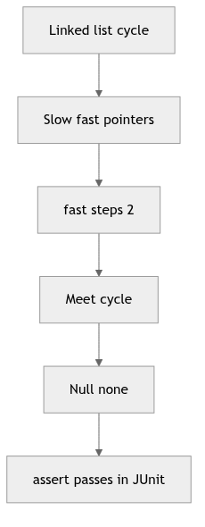 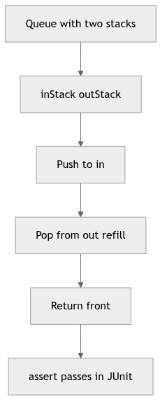 |
| Q21 | Merge two sorted lists | 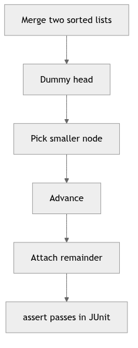 |
| Q22 | Remove nth from end / LCA | 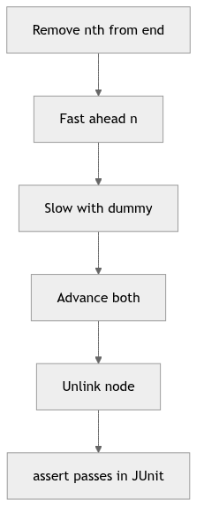 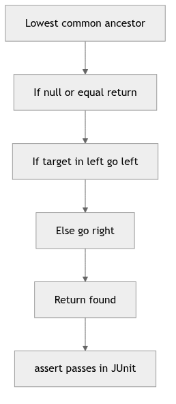 |

### Trees & BST
| # | Question | Diagram |
|---|---|---|
| Q23 | Max depth / Validate BST | 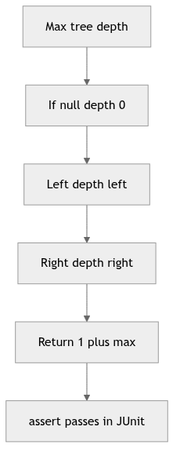 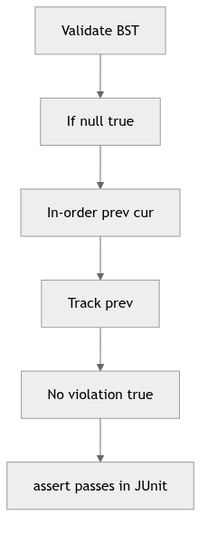 |
| Q24 | In-order / Serialize tree | 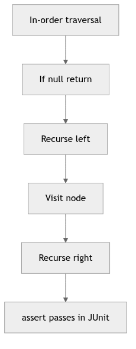 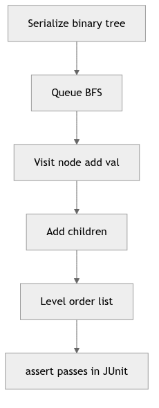 |
| Q25 | Same tree | 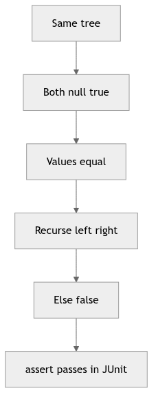 |
| Q26 | Num islands / Diameter | 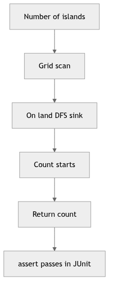 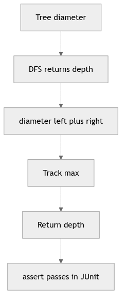 |
| Q27 | Clone graph / Mirror | 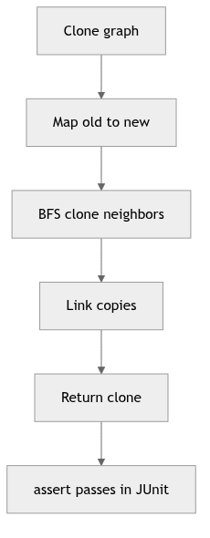 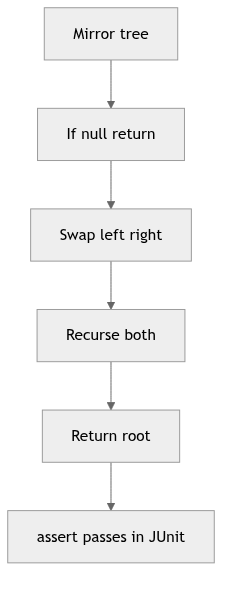 |
| Q28 | Course schedule (topo) | 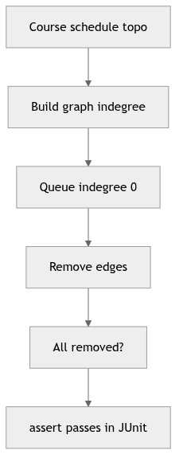 |

### Graphs
| # | Question | Diagram |
|---|---|---|
| Q29 | Dijkstra | 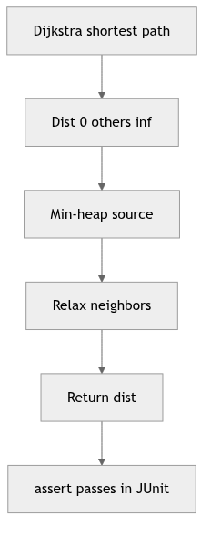 |
| Q30 | BFS shortest path | 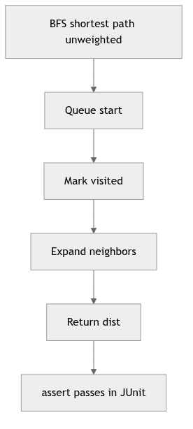 |
| Q31 | Fibonacci / Undirected cycle | 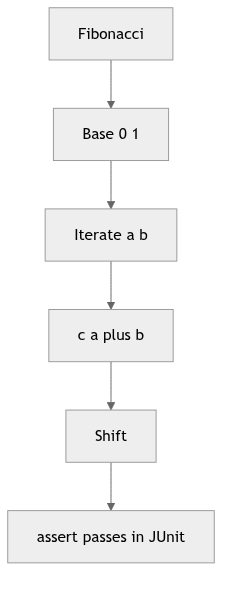 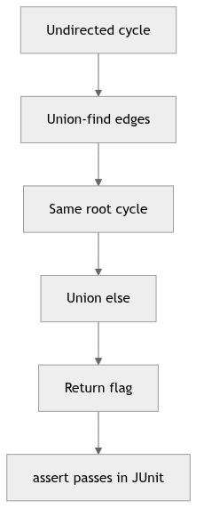 |
| Q32 | Climb stairs / Bipartite | 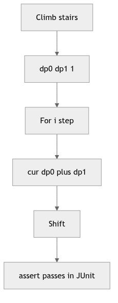 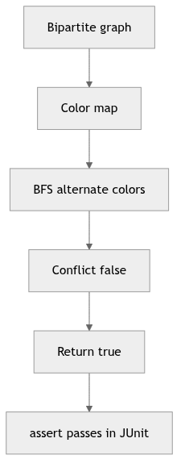 |
| Q33 | Coin change / Connected components | 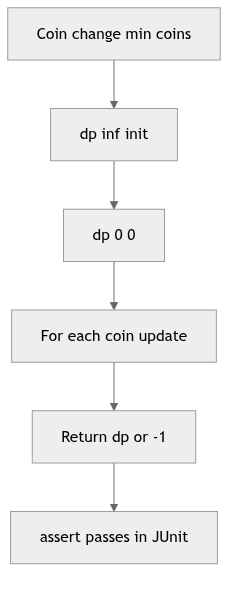 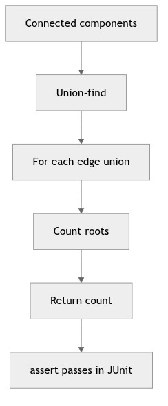 |
| Q34 | LIS / Bridge edges |   |

### Dynamic Programming & Bits
| # | Question | Diagram |
|---|---|---|
| Q35 | Edit distance |  |
| Q36 | 0-1 Knapsack |  |
| Q37 | Single number (xor) |  |
| Q38 | Count bits / Interpolation search |   |
| Q39 | Power of two / Kth smallest |   |
| Q40 | Reverse bits / Count inversions |   |

---

## 🔧 The 20+ Algorithms (each has a diagram)

| # | Algorithm | Diagram |
|---|---|---|
| A1 | Bubble sort |  |
| A2 | Merge sort |  |
| A3 | Quick sort |  |
| A4 | Heap sort |  |
| A5 | BFS |  |
| A6 | DFS |  |
| A7 | Union-Find |  |
| A8 | Sieve of Eratosthenes |  |
| A9 | GCD (Euclid) |  |
| A10 | Modular exponentiation |  |
| A11 | Sliding window maximum |  |
| A12 | Topological sort |  |
| A13 | Kruskal MST |  |
| A14 | Fast power |  |
| A15 | Longest common subsequence |  |
| A16 | Level-order traversal |  |
| A17 | Prim MST |  |
| A18 | Matrix chain multiplication |  |
| A19 | Lowest set bit |  |
| A20 | Clear lowest set bit |  |
| A21 | Selection sort |  |
| A22 | Insertion sort |  |
| A23 | LCM via GCD |  |
| A24 | Euler totient |  |
| A25 | KMP search |  |
| A26 | Rabin-Karp |  |
| A27 | Trie |  |
| A28 | Subsets (backtrack) |  |
| A29 | Permutations (backtrack) |  |
| A30 | N-Queens |  |
| A31 | Segment tree |  |

---

## 🧪 Testing

```bash
./gradlew test
```

- **96 tests**, all passing. Every `@Test` is named `<Q|A><n>_<topic>` so a failure maps straight to
  a question or algorithm.
- Tests assert real invariants (e.g. `twoSum` returns the right indices, `heapSort` yields ascending
  order, `kthSmallest` of `[7,10,4,3,20,15]` k=3 is `7`, `countInversions` of `[2,4,1,3,5]` is `3`).

---

## 🗂️ Layout

```
dsa-java-gradleqa/
├── build.gradle
├── settings.gradle
├── gradle/wrapper/            # Gradle 8.2.1 (Java 17)
├── scripts/gen_qa_diagrams.py # emits one mermaid .mmd per test method
├── docs/diagrams/             # 90 per-method PNGs + 8 overview PNGs + .mmd sources
└── src/
    ├── main/java/dsa/Algorithms.java   # all Q + A methods
    └── test/java/dsa/AlgorithmsTest.java # 96 JUnit tests (named per method)
```

---

## 🔧 Tech & conventions
- **Java 17** (sdkman `17.0.12-graal`) · **Gradle 8.2.1** · **JUnit 5.9.1**
- Modern Java: `record` (e.g. `Result`, `Subarray`), `sealed` where useful, `var`, Stream API
  (`groupAnagrams`, `sumNumbers`), generics + wildcards, `Optional`, pattern-matching `switch`.
- Diagrams: generated with Mermaid CLI (`mmdc`) → **PNG only** (no SVG), one per question/algorithm.
- Regenerate diagrams anytime: `python3 scripts/gen_qa_diagrams.py && mmdc -i docs/diagrams/<m>.mmd -o docs/diagrams/<m>.png -t neutral`
